# 1. Introduction

I've been doing course work on QNX, and after the advanced course on writing drivers I thought I'd exercise myself by writing one for a particular use case: a **QNX resource manager that lets control applications talk to an industrial machine over OPC UA**.

This isn't a polished tutorial from someone who already knew the answers. I learned most of this while building it. The design changed several times along the way, and I'll mention the wrong turns where they taught me something.

## The goal

On one side sit control applications running on QNX. They know *what* they want to do: "what is the spindle doing", "change to tool 4", "stop the machine". On the other side sits a machine that speaks **OPC UA**, an open standard for industrial communication, published by the OPC Foundation and standardised as IEC 62541 ([OPC Foundation](https://jp.opcfoundation.org/wp-content/uploads/2014/03/OPC_UA_Brochure_US_2013_v2.pdf)). Chapter 2 explains the parts of it this project needs.

The driver sits in between and **translates**. Applications see two ordinary files; the driver turns file operations into OPC UA requests and OPC UA answers back into file semantics:

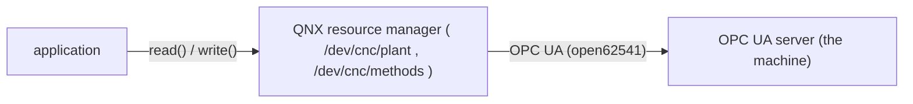

- **`/dev/cnc/plant`**: `read()` returns the latest state of the whole machine as one C struct: spindle, feed, tool, vibration, production counters and so on, all from the same reading.
- **`/dev/cnc/methods`**: `write()` sends a command to the machine, such as an emergency stop or a tool change. It returns once the machine has executed it, or fails with a meaningful `errno`.

On the QNX side, the OPC UA client is built with [open62541](https://www.open62541.org/), an open-source C implementation of OPC UA ([list of open-source implementations](https://github.com/open62541/open62541/wiki/List-of-Open-Source-OPC-UA-Implementations)).

Everything an application needs is in one header, `opcua_cnc_map.h`: the two paths, the data structures and the commands. It contains no OPC UA and no QNX internals. Applications only see a device.

## One deliberate boundary

**The driver is not a controller.** It doesn't decide what should happen when a tool wears out or vibration rises; that is the job of the applications using it. The driver's job is to translate faithfully and to fail honestly:

- data comes with a sequence number and a "connected" flag, so an application can tell fresh values from stale ones;
- every command gets its own answer, or a clear error such as "no link to the machine" or "timed out";
- a slow or unreachable machine never makes the driver itself unresponsive.

One honest note on the word "driver": there's no hardware access here, no interrupts and no registers. It's really a **protocol resource manager**, a gateway between QNX's file-based world and a network protocol. In QNX, a resource manager is a process that registers a pathname and then handles the messages that `open()`, `read()`, `write()` and the other POSIX calls generate on it ([QNX: What Is a Resource Manager?](https://www.qnx.com/developers/docs/8.0/com.qnx.doc.neutrino.resmgr/topic/overview.html)). That suited me as an exercise, because it still needs the same QNX techniques a hardware driver uses: path registration, message handling, thread pools, deferred replies and clean shutdown.

## The approach

I split the work along the same lines as the system, one chapter each:

1. **The plant**: a ready-made OPC UA server that simulates a CNC lathe, running on a Raspberry Pi. I chose an existing simulator on purpose, because the point of the exercise is the driver, not the simulation.
2. **The topology**: how a Windows PC, a QNX virtual machine and the Pi are connected, and the networking detail that made QNX unable to reach the Pi at first.
3. **The resource manager**: the interface, the four QNX layers, the threads and how they cooperate, and how commands are queued and answered without ever blocking the driver.
4. **Using the driver**: what the interface looks like from an application, what a `read()` and a `write()` cost, and the send-receive-reply structure that makes the whole thing work.

The source is on GitHub, listed at the end.


# 2. The Plant

To test a driver you need something on the other end of the network that behaves like a real machine speaking OPC UA. I didn't have a CNC lathe lying around, and I didn't want to write a simulator myself, so "the plant" is a Raspberry Pi running an open-source OPC UA server that simulates one.


*What a real CNC lathe looks like. Photo: "Machinist inspecting a CNC lathe" by Somesomething243, [Wikimedia Commons](https://commons.wikimedia.org/wiki/File:Cnc_lathe.png), licensed [CC BY-SA 4.0](https://creativecommons.org/licenses/by-sa/4.0/). Unmodified.*

Before writing any driver code I had to learn two things: what OPC UA actually is, and how this particular server behaves. Some of it surprised me (a writable value that does nothing, for one). This chapter is the short version of both: only what you need to write a driver for it.

## OPC UA in five minutes

I knew OPC UA by name, but not how it works. Here's the part I needed, with links to the specification so you can go deeper.

**What it is.** OPC UA (Open Platform Communications Unified Architecture) is published by the OPC Foundation and standardised internationally as **IEC 62541** ([OPC Foundation brochure](https://jp.opcfoundation.org/wp-content/uploads/2014/03/OPC_UA_Brochure_US_2013_v2.pdf)). In the mode used here it is **client/server**: a client sends a request and the server answers ([Part 1, §5](https://reference.opcfoundation.org/Core/Part1/v105/docs/5)). Our driver is the client; the Pi is the server.


*The OPC UA client/server pattern: the client asks (request), the server answers (response). Image: "OPC-UA-Server-Client" by Monkhiker, [Wikimedia Commons](https://commons.wikimedia.org/wiki/File:OPC-UA-Server-Client.jpg), licensed [CC BY-SA 4.0](https://creativecommons.org/licenses/by-sa/4.0/). Unmodified.*

**How it travels.** The common transport is a binary protocol over TCP, written `opc.tcp://host:port/...`, and **port 4840** is reserved for it ([OPC Foundation brochure](https://jp.opcfoundation.org/wp-content/uploads/2014/03/OPC_UA_Brochure_US_2013_v2.pdf), [Wireshark wiki: OPC](https://wiki.wireshark.org/OPC)).

**How a server presents its data: the address space.** A server exposes everything as a graph of **nodes** connected by **references** ([Part 3](https://reference.opcfoundation.org/specs/OPC-10000-3/full)). Every node has a **NodeClass**; the specification defines eight, and this project only meets three ([Part 8, A.4.2](https://reference.opcfoundation.org/v104/Core/docs/Part8/A.4.2/)):

| NodeClass | What it is | In our machine |
|---|---|---|
| **Object** | a thing that groups other nodes | `Spindle`, `Tool`, `Methods`, … |
| **Variable** | holds a value: *"used to represent values which may be simple or complex"* | `Spindle/Speed`, `Tool/State`, … |
| **Method** | *"callable functions"* | `EmergencyStop`, `ChangeTool`, … |

(Definitions quoted from [Part 3, §5.6.2 and §5.7.1](https://reference.opcfoundation.org/search?q=NodeClass&scope=core).)

**How a node is identified.**
- A **NodeId** identifies a node uniquely. It has a **namespace index** and an identifier, for example `ns=2;i=9`.
- Each namespace index stands for a **namespace URI**. Index 0 is reserved for the OPC UA specification's own nodes (`http://opcfoundation.org/UA/`), and a server's own nodes live in other namespaces ([namespace table example](https://reference.opcfoundation.org/search?q=BrowseNames&scope=core)).
- Every node also has a human-readable **BrowseName**. A **BrowsePath** is *"a sequence of BrowseNames used to describe a path between Nodes"* ([Part 3, §6.2.5](https://reference.opcfoundation.org/search?q=BrowseNames&scope=core)), for example `Spindle/Speed`.

**What a client can ask for: services.** Requests are called services, grouped into service sets ([Part 4, §4](https://reference.opcfoundation.org/Core/Part4/v105/docs/4)). The driver needs exactly three:

| Service | What it does ([Part 4](https://reference.opcfoundation.org/specs/OPC-10000-4/full)) | What the driver uses it for |
|---|---|---|
| **TranslateBrowsePathsToNodeIds** | turns BrowsePaths into NodeIds | finding every value by its path, once, after connecting |
| **Read** | reads attributes of nodes; a variable's value is one of them | reading all values in one request, twice a second |
| **Call** | calls methods | the three commands |

OPC UA can also push changes to a client through **subscriptions** ([Part 4, §4](https://reference.opcfoundation.org/Core/Part4/v105/docs/4)). The driver deliberately polls with Read instead; chapter 4 explains why.

**How a connection is set up.** A client first opens a **SecureChannel**, then creates a **Session** on top of it ([Part 4, §5.6–5.7](https://reference.opcfoundation.org/specs/OPC-10000-4/5)). Security is chosen per endpoint, and the specification notes that some security policies *"turn off authentication and encryption"*. That's the `None` policy this lab uses.

## Running the server

The server is [aaronzi/opcua-timeseries](https://github.com/aaronzi/opcua-timeseries) (commit `cc653d6`), written in Python with the [`asyncua`](https://github.com/FreeOpcUa/opcua-asyncio) library. It simulates a **DMG MORI CTX 650 CNC lathe**, the name set in its [`config/server_config.yaml`](https://github.com/aaronzi/opcua-timeseries/blob/main/config/server_config.yaml).

| | |
|---|---|
| Board | Raspberry Pi Zero 2 W, Raspberry Pi OS Lite (64-bit), on the LAN over Wi-Fi |
| Server | built from the repository's `Dockerfile`, run in a container |
| Endpoint | `opc.tcp://X.X.X.X:4840/freeopcua/server/` (`server.endpoint` in the configuration) |
| Security | policy `None`, anonymous login: fine for a lab network, listed under future work |

```sh
git clone https://github.com/aaronzi/opcua-timeseries
cd opcua-timeseries
docker build -t opcua-timeseries .
docker run -d --name opcua-cnc -p 4840:4840 opcua-timeseries
```

The only build problem was a pinned `gcc` version in the `Dockerfile` that isn't available on the Pi. Removing the pin fixed it.

## The key intuition: the plant ticks once per second

Every second, the server advances its simulation by one step and then rewrites **all** its OPC UA values. Between two ticks nothing changes. This loop is `_update_loop()` in [`server/opcua_server.py`](https://github.com/aaronzi/opcua-timeseries/blob/main/server/opcua_server.py), and the one second comes from `simulation.update_interval: 1.0` in the configuration. Two things follow for a driver:

- Reading the plant about twice per tick is plenty. The driver reads every 500 ms.
- A command takes effect on the **next** tick, so right after a command you may still read the old value for up to a second.

The data flows one way only: from the simulation into the OPC UA values. The simulation never reads them back.

## What the machine exposes

In OPC UA terms, the machine is one **Object**, `DMG MORI CTX 650 CNC Lathe`, under the server's `Objects` folder. Everything else hangs below it as Objects, Variables and Methods, all in the namespace `http://manufacturing.example.com/cnc` (`server.namespace` in the configuration). I dumped this tree from the running server:

| Object | Variables / Methods | Type |
|---|---|---|
| `State` | CurrentState (`Idle` / `Running` / `Alarm`) | String |
| `Spindle` | Speed, Load, Torque, Power, Temperature | Double |
| `FeedSystem` | FeedRate, Override, Position X / Y / Z | Double |
| `Tool` | Number, LifeRemaining, WearX, WearZ, State (`New` / `Good` / `Worn` / `Broken`) | Int32, Double, String |
| `Vibration` | X_Axis, Y_Axis, Z_Axis, Overall | Double |
| `Production` | PartsProduced, GoodParts, RejectedParts, CycleTime, Efficiency | Int32, Double |
| `AuxiliarySystems` | CoolantLevel, CoolantTemperature, AirPressure, HydraulicPressure | Double |
| `Information` | Manufacturer, Model, SerialNumber | String |
| *(top level)* | Timestamp, the time of the last tick | DateTime |
| `Methods` | EmergencyStop, ChangeTool, ResetProductionCounters | Method |

Everything is read-only except `State/CurrentState`, which is explained below.

The server creates its nodes without choosing NodeIds itself, so they get numeric ones (`ns=2;i=1`, `i=2`, …) in creation order. Those numbers aren't guaranteed to stay the same, so a driver should find each value by its **BrowsePath** (for example `Spindle/Speed`), not by its number.

The machine's part programs (which part is being made, and how far along it is) are internal to the simulation only. They aren't published.

## How the machine behaves

The machine runs on its own; nobody has to start it. This behaviour is implemented in `_update_machine_state()` in [`server/simulation.py`](https://github.com/aaronzi/opcua-timeseries/blob/main/server/simulation.py):

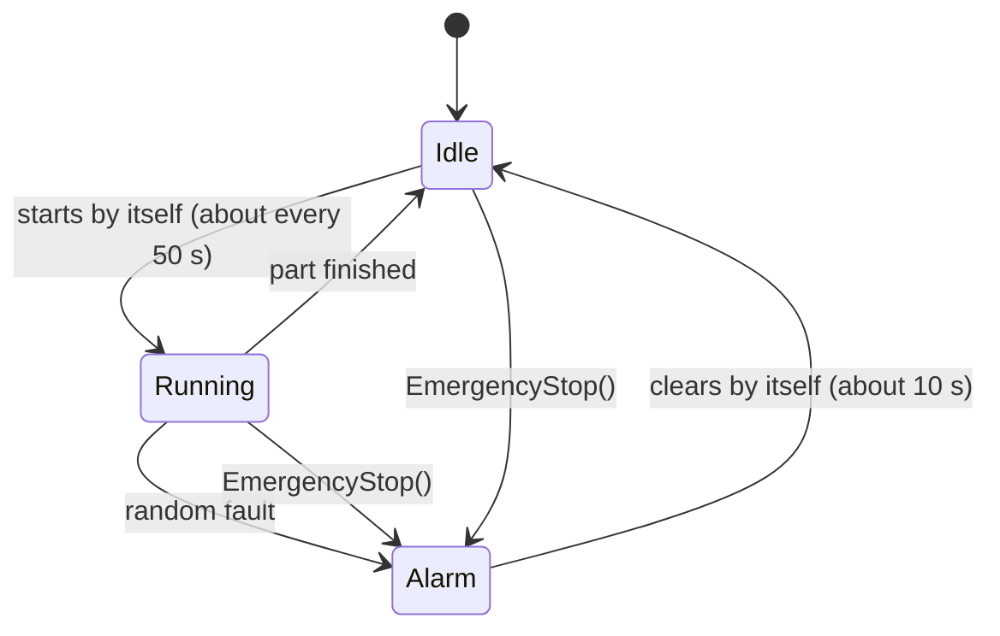

- **Idle → Running:** the machine starts a new part at random, a 2 % chance per tick, so on average after about 50 s.
- **Running → Idle:** the part is finished, after 150–240 s, and the production counters go up.
- **Running → Alarm:** occasionally a random fault occurs, a 0.1 % chance per tick. Roughly one part in six ends in an alarm.
- **Alarm → Idle:** an alarm clears by itself, a 10 % chance per tick, so after about 10 s on average. No command can clear it sooner.

What changes on its own while it runs, as intuition rather than formulas (all from the same `simulation.py`):

- **Spindle and feed** ramp up to the part's speeds and ramp down to 0 when the machine stops. Load, torque, power and temperature follow the speed.
- **The tool wears out while cutting** and is `Broken` after about three minutes of machining. Nothing replaces it automatically, so changing the tool is the application's job.
- **Vibration** rises with speed and with tool wear; a worn-out tool can triple it.
- **Coolant** drains slowly while cutting and is never refilled.
- **Positions** only move while running; otherwise they keep their last value.
- **Pressures and temperatures** are noisy values around fixed levels.

## The commands

The three **Methods** are the only real way to influence the machine. They're defined in `_add_methods()` in [`server/opcua_server.py`](https://github.com/aaronzi/opcua-timeseries/blob/main/server/opcua_server.py):

| Method | Argument | Effect |
|---|---|---|
| `EmergencyStop()` | none | the machine goes to `Alarm`; a running part is lost |
| `ChangeTool(n)` | tool number (Int32) | new tool: wear reset, life back to 100 % |
| `ResetProductionCounters()` | none | part counters back to 0 |

Two things worth knowing:

- After `ChangeTool`, `Tool/State` keeps its old value (for example `Broken`) until the machine runs again.
- After `EmergencyStop`, the spindle ramps down rather than stopping instantly.

**`State/CurrentState` is writable, but writing it does nothing.** The next tick overwrites it with the real state, so writing `Running` doesn't start the machine and writing `Idle` doesn't clear an alarm. That's why the driver doesn't offer a "set state" command.

## Checklist for the driver

- Connect (SecureChannel, then Session), then resolve every BrowsePath to a NodeId once.
- Read every value in one Read request, about every 500 ms.
- Use `Timestamp` to tell how fresh the data is.
- Use the exact types: Double for measurements, Int32 for counters and the tool number, String for states, DateTime for the timestamp.
- Offer the three Methods as the commands (one Call each), and expect their effect one tick later.


# 3. The Topology

The setup is small: one Windows PC running **VirtualBox** with a **QNX 8** virtual machine [How to get QNX in VM?](https://www.qnx.com/developers/docs/8.0/com.qnx.doc.ide.userguide/topic/creating_qnx_vm.html), plus the **Raspberry Pi** from chapter 2 on the same local network.

I expected this part to take five minutes. It didn't: my first attempt simply couldn't reach the Pi, and it took a bit of reading to understand why. So this chapter explains the wiring and the reason behind it, with references to the official QNX and VirtualBox documentation so you don't have to take my word for it.

## The pieces

| Machine | Role | Address |
|---|---|---|
| Windows host | runs VirtualBox and the Momentics IDE | its own LAN address |
| QNX 8 VM (VirtualBox) | runs the driver and the applications | `vtnet0` 192.168.X.X, `vtnet1` 10.0.X.X |
| Raspberry Pi Zero 2 W | the plant: OPC UA server in Docker, port 4840 | X.X.X.X on the LAN (Wi-Fi) |

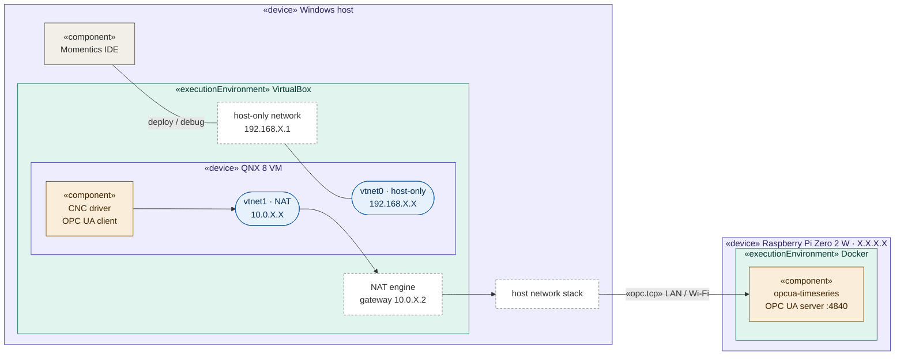

Colours: purple = devices, teal = execution environments, amber = the OPC UA client and server, blue = the QNX VM's network interfaces, dashed = virtual networks.

## The QNX side: two virtio interfaces

In VirtualBox both adapters are of type *Paravirtualized Network (virtio-net)*. On QNX 8 the matching driver is `devs-vtnet_pci.so`, the io-sock *"Driver for VirtIO PCI Ethernet devices"*, and its interfaces are named `vtnet0`, `vtnet1`, … ([devs-vtnet_pci.so](https://www.qnx.com/developers/docs/8.0/com.qnx.doc.neutrino.utilities/topic/d/devs-vtnet_pci.so.html), [default interface names](https://www.qnx.com/developers/docs/8.0/com.qnx.doc.qnxsdp.migration/topic/bsp_support.html)). Each interface has one job:

- **`vtnet0` (host-only):** Momentics ↔ QNX, for deploying and debugging.
- **`vtnet1` (NAT):** QNX → the outside world. This is the driver's path to the Pi.

## Why host-only alone wasn't enough

At first the QNX VM only had `vtnet0`, attached to VirtualBox's **host-only** network. The VirtualBox manual is explicit about what that network can reach. Its overview table lists host-only as allowing VM→host, host→VM and VM↔VM, but **not VM→LAN**. It says the VMs *"cannot talk to the world outside the host since they are not connected to a physical networking interface"* ([VirtualBox manual, §6.2 and §6.7](https://www.virtualbox.org/manual/ch06.html)).

That's perfect for Momentics, but by design a dead end for reaching the Pi:

```
# ping X.X.X.X
ping: sendto: No route to host
```

## The fix: a second adapter in NAT mode

I added a second network adapter in VirtualBox, set to **NAT**, with adapter type *virtio-net*. The manual describes NAT as working *"much like a real computer that connects to the Internet through a router"*, where *"the router, in this case, is the VirtualBox networking engine"*. The guest's traffic is *"resent using the host operating system"*, so to the rest of the network it looks as if it comes from the host ([§6.3](https://www.virtualbox.org/manual/ch06.html#network_nat)). Anything the Windows host can reach, QNX can now reach too, including the Pi.

The NAT network hands out addresses with its own built-in DHCP server, and its subnet depends on the adapter's position: *"the first card is connected to the private network 10.0.2.0, the second card to the network 10.0.3.0"* ([§6.3](https://www.virtualbox.org/manual/ch06.html#network_nat)). On QNX 8, the DHCP client is `dhcpcd` ([migration guide](https://www.qnx.com/developers/docs/8.0/com.qnx.doc.qnxsdp.migration/topic/bsps.html), [dhcpcd](https://www.qnx.com/developers/docs/8.0/com.qnx.doc.neutrino.utilities/topic/d/dhcpcd.html)):

```sh
dhcpcd vtnet1              # address on the NAT network + default route via the NAT engine
netstat -rn | grep default
```

## The path the driver uses

```
CNC driver ─▶ vtnet1 ─▶ VirtualBox NAT ─▶ Windows host ─▶ LAN / Wi-Fi ─▶ Pi :4840 (OPC UA)
```

Verified from QNX: the Pi answers `ping`, port 4840 accepts TCP connections, and the driver's OPC UA client completes the full connection (secure channel, then session) with the server.

Two side notes from the same VirtualBox chapter:

- NAT is outbound only: the VM is *"invisible and unreachable from the outside"* unless port forwarding is set up. That's fine here, because QNX is always the one that connects.
- VirtualBox's NAT has *"ICMP protocol limitations"*: `ping` should work, but other ICMP-based tools may not. If `ping` behaves oddly, test with a TCP connection instead.

## One thing to know when rebuilding the VM

If the QNX VM is recreated, for example with `mkqnximage`, check that the NAT adapter still exists and run `dhcpcd vtnet1` again. Without it, the driver starts normally but can never reach the plant.


# 4. The Resource Manager

This is the chapter I rewrote the most, because the driver itself changed the most. My first version had one path per machine part and a [`devctl()`](https://www.qnx.com/developers/docs/8.0/com.qnx.doc.neutrino.lib_ref/topic/d/devctl.html) command for each. Then I had a version where command threads blocked the whole driver. Then one where two threads shared one OPC UA client, which simply didn't work. What's described here is where I ended up, and along the way I'll say why the earlier attempts were dropped.

The driver is one QNX process. From the application side, it is a resource manager that answers `read()` and `write()` on `/dev/cnc/*`. From the machine side, the same process is an OPC UA client that opens two sessions and sends Read and Call requests.

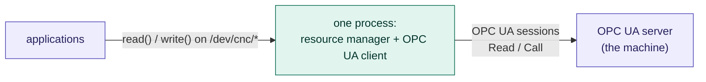

The driver is four files. (The interactive tool `cnc_read.c` from chapter 5 is separate, and not part of the driver itself.)

| File | Side | Contains |
|---|---|---|
| `opcua_cnc_map.h` | contract | paths, structs, `errno` meanings |
| `MyDriver.c` | resource manager | paths, handlers, command queue, threads, shutdown |
| `opcua_client.h` / `.c` | OPC UA client | two sessions, snapshot, method calls |
| `cnc_log.h` | --- | timestamped log lines |

`MyDriver.c` never includes `open62541.h`, and `opcua_client.c` never includes `<sys/iofunc.h>`. They meet through `opcua_client.h`: four functions (`opcua_client_start()`, `opcua_client_stop()`, `opcua_client_get()`, `opcua_client_call()`) and one configuration struct, `opcua_cfg_t`.

## The interface: two files

Applications see two paths and include one header:

```c
#define CNC_PATH_PLANT    "/dev/cnc/plant"     /* 0444, read only  */
#define CNC_PATH_METHODS  "/dev/cnc/methods"   /* 0220, write only */
```

**Reading the plant.** A `read()` on `/dev/cnc/plant` returns one `cnc_plant_t`: a header (`seq`, the plant's `Timestamp`, a `connected` flag) followed by every group from chapter 2 (spindle, feed, tool, …), all from the same reading. To poll with an open file descriptor, use `pread()` at offset 0:

```c
cnc_plant_t p;
int fd = open(CNC_PATH_PLANT, O_RDONLY);
pread(fd, &p, sizeof p, 0);              /* always the latest snapshot */
printf("%.0f rpm, tool %d\n", p.spindle.speed_rpm, (int)p.tool.number);
```

**Sending a command.** A `write()` of one `cnc_cmd_t` to `/dev/cnc/methods` runs one of the three methods. It returns when the machine has executed it, or fails with an `errno`:

```c
cnc_cmd_t cmd = { CNC_CHANGE_TOOL, 4 };
int fd = open(CNC_PATH_METHODS, O_WRONLY);
if (write(fd, &cmd, sizeof cmd) != sizeof cmd)
    perror("ChangeTool");
```

| `errno` | meaning |
|---|---|
| `EBUSY` | the command queue is full; retry later |
| `EIO` | no link to the machine |
| `ETIMEDOUT` | the machine didn't answer in time |
| `EACCES` | the machine refused the method |
| `EINVAL` | malformed command |
| `EINTR` | the caller was interrupted while waiting (see "Interrupted callers" below) |
| `ECANCELED` | the driver is shutting down |

Who may send commands is decided by ordinary file permissions: `/dev/cnc/methods` has mode `0220`.

**Why `read()`/`write()` and not `devctl()`.** My first design had eight paths, one per machine part, each answering `devctl()` commands with its own struct. It worked, but it was a lot of interface for little gain. One `read()` of the whole plant (432 bytes) costs practically the same as a small `devctl()`, because the message round trip dominates, not the copy. It's also *more* consistent: an application gets every value from the same reading, instead of combining several calls that may straddle a new reading.

## The four QNX layers

A QNX resource manager is composed of some of the following layers, as the QNX documentation states: **thread pool layer (the top layer), dispatch layer, resmgr layer, iofunc layer (the bottom layer)** ([*Layers in a resource manager*](https://www.qnx.com/developers/docs/8.0/com.qnx.doc.neutrino.resmgr/topic/skeleton_RESMGR_layers.html)).

From the bottom up:

**1. iofunc layer (bottom).** It *"consists of a set of functions that take care of most of the POSIX filesystem details for you—they provide a POSIX personality"* and *"consists of default handlers that the resource manager library uses if you don't provide a handler"*. It also contains helper functions that the default handlers call. If you provide your own `io_read` handler, you should call `iofunc_read_verify()` at the start to check that the client has access. Names begin with `iofunc_`. Header: `<sys/iofunc.h>`.

**2. resmgr layer.** It *"manages most of the resource manager library details"*: it *"examines incoming messages"* and *"calls the appropriate handler to process a message"*. Names begin with `resmgr_`. Header: `<sys/resmgr.h>`.

**3. dispatch layer.** It *"acts as a single blocking point for many different types of things"*. It handles:

- `_IO_*` messages — *"it uses the resmgr layer for this"*
- `select()` — for TCP/IP-style blocking
- Pulses — *"you register a handler function that's called when a specific pulse arrives"*
- Other messages — custom message types

The functions for this layer are `dispatch_create()`, `dispatch_block()`, and `dispatch_handler()`.

**4. thread pool layer (top).** It *"allows you to have a single- or multithreaded resource manager"*, meaning *"one thread can be handling a write() while another thread handles a read()"*. You provide *"the blocking function for the threads to use as well as the handler function that's to be called when the blocking function returns"*. Most often you give it the dispatch layer's functions. You can use this layer independently of a resource manager, as a general-purpose dynamic thread pool.

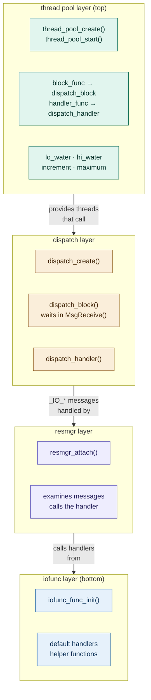

The data flows **top to bottom**: the thread pool provides threads, each thread calls the dispatch layer's blocking function, the dispatch layer examines the message and calls the resmgr layer for `_IO_*` messages, and the resmgr layer calls the handler — which is either a default from the iofunc layer or your own override.

## How a message flows through the layers

The QNX documentation's own description of message handling via `dispatch_handler()`: a search is made based on the message type; if the type is in the range handled by the resource manager and pathnames were attached with `resmgr_attach()`, *"the resource manager subsystem is called and handles the resource manager message"*.

For a `read()` from an application, the flow is:

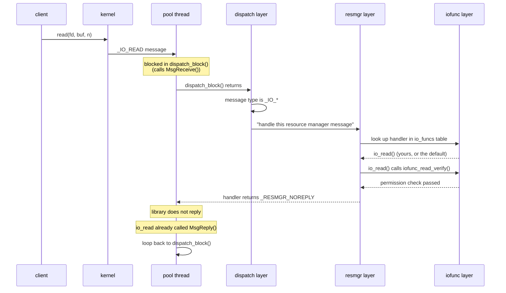

And for a `write()`:

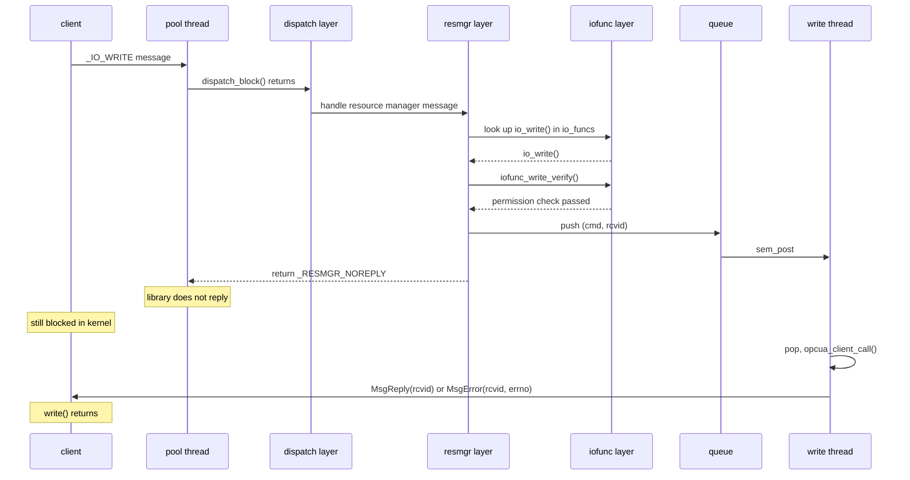

The key point: `_RESMGR_NOREPLY` is a return value to the **dispatch layer** (through the resmgr layer). It says "do not reply on my behalf." In the read case, `io_read` already called `MsgReply()`. In the write case, the reply will come later from the write thread using the saved `rcvid`.

## Registering the paths

A resource manager registers a pathname, and from then on the messages generated by `open()`, `read()`, `write()` and so on arrive at it ([*Writing a Resource Manager*](https://www.qnx.com/developers/docs/8.0/com.qnx.doc.neutrino.resmgr/topic/about.html)). To serve two paths, the QNX documentation's recipe is to call `resmgr_attach()` once per name, *"passing in a unique name and a unique attribute structure"* ([*Writing a Resource Manager*](https://www.qnx.com/developers/docs/8.0/com.qnx.doc.neutrino.resmgr/topic/about.html)).

To let one handler tell the two paths apart, the attribute structure is extended with an id. As in the documentation's example, the standard `iofunc_attr_t` *"must always be first"*, and `IOFUNC_ATTR_T` is defined before the includes ([*Writing a Resource Manager*](https://www.qnx.com/developers/docs/8.0/com.qnx.doc.neutrino.resmgr/topic/about.html)):

```c
struct cnc_attr;
#define IOFUNC_ATTR_T       struct cnc_attr
#define THREAD_POOL_PARAM_T dispatch_context_t
#include <sys/iofunc.h>
#include <sys/dispatch.h>

struct cnc_attr {
    iofunc_attr_t attr;         /* must be first */
    path_id_t     id;           /* PATH_PLANT or PATH_METHODS */
};
```

Each handler then checks `ocb->attr->id` to know which path the client opened. (`THREAD_POOL_PARAM_T` is there to avoid compiler warnings with the thread pool, exactly as in the multithreaded example in [*Writing a Resource Manager*](https://www.qnx.com/developers/docs/8.0/com.qnx.doc.neutrino.resmgr/topic/about.html).)

## The thread pool layer

The pool is created at the end of `main()`, with the same fields as QNX's own example ([*Writing a Resource Manager*](https://www.qnx.com/developers/docs/8.0/com.qnx.doc.neutrino.resmgr/topic/about.html)):

```c
pool.handle        = dpp;
pool.context_alloc = dispatch_context_alloc;
pool.block_func    = dispatch_block;
pool.handler_func  = dispatch_handler;
pool.unblock_func  = dispatch_unblock;
pool.context_free  = dispatch_context_free;
pool.lo_water      = 2;
pool.increment     = 1;
pool.hi_water      = 4;
pool.maximum       = 8;

thread_pool_start(thread_pool_create(&pool, POOL_FLAG_EXIT_SELF));   /* does not return */
```

Each pool thread runs the same loop: it allocates a context, calls the blocking function (`dispatch_block()`, which waits in `MsgReceive()`), and when a message arrives calls the handler function (`dispatch_handler()`). When the handler returns, the thread goes back to blocking.

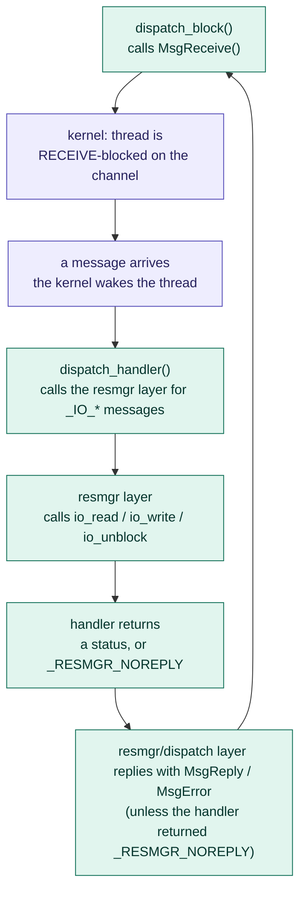

The four pool parameters, as the QNX documentation defines them ([*Writing a Resource Manager*](https://www.qnx.com/developers/docs/8.0/com.qnx.doc.neutrino.resmgr/topic/about.html)):

| Parameter | Value | Meaning |
|---|---|---|
| `lo_water` | 2 | minimum number of RECEIVE-blocked threads |
| `increment` | 1 | how many threads to create at a time to get back to `lo_water` |
| `hi_water` | 4 | maximum number of RECEIVE-blocked threads; beyond it, threads *"destroy themselves"* |
| `maximum` | 8 | total number of threads in the pool at any time |

So there are always at least two threads waiting for a message. If both get busy, the pool creates another, never more than eight in total. This follows the guide's advice to design a multithreaded resource manager *"so there's always at least one RECEIVE-blocked thread"* ([*Writing a Resource Manager*](https://www.qnx.com/developers/docs/8.0/com.qnx.doc.neutrino.resmgr/topic/about.html)).

### Why the pool threads have no fixed priority

QNX uses *"message-driven priority inheritance"* ([*System Architecture*](https://www.qnx.com/developers/docs/8.0/com.qnx.doc.neutrino.sys_arch/topic/ipc_Priority_inheritance_messages.html)). If a server thread is RECEIVE-blocked when a client sends a message, the kernel boosts the thread that receives it: *"as soon as the MsgReceive() function unblocks the server, the (new) client's priority is inherited by the server"*.

So a fixed priority for the pool threads isn't needed: a high-priority reader is served at high priority automatically. The two threads that nobody sends messages to, the read thread and the write thread, set explicit priorities (10 and 12) because inheritance can't help them.

One caveat from the code: with `-U` the driver drops root before starting those threads. If that also drops the right to set the scheduling policy, their `pthread_setschedparam()` call fails, a `WARN` is logged, and they keep the inherited priority. Correct, but not the priority asked for.

## The two shared data structures

The rule that shaped everything: a thread that receives a client's message never waits on the network. Reads are answered from memory; commands are handed to a worker that answers later; each of the two OPC UA sessions belongs to exactly one thread.

The two sides of the process meet in exactly two structures: the snapshot and the command queue. Everything else belongs to one thread or one session. One application can use both paths from the same process: read() a snapshot, write() a command.

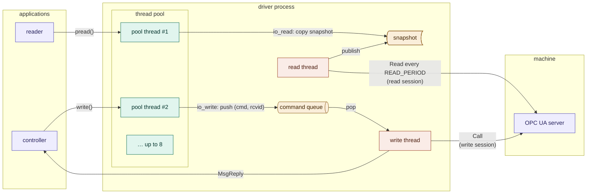

Teal = pool threads, coral = the driver's own threads, amber = shared data (the snapshot as stored data, the queue as a queue), purple = outside the driver. `READ_PERIOD` is the read thread's period, 500 ms (`read_period_ms` in `opcua_cfg_t`).

- **The snapshot** is one `cnc_plant_t` protected by one `pthread_mutex_t`. The read thread is the only writer; `io_read` on the pool threads are the readers.
- **The command queue** is a 16-entry ring buffer protected by `q_lock` (a `pthread_mutex_t`) plus a semaphore, `q_items`. `io_write` pushes; the write thread pops.

## What `return _RESMGR_NOREPLY` means

This is the one detail that confused me most, so it gets its own section before the two handlers. A handler can return in two ways ([*Writing a Resource Manager*](https://www.qnx.com/developers/docs/8.0/com.qnx.doc.neutrino.resmgr/topic/about.html)):

- **Return a status (`EOK` or an `errno`).** Then *"it's the resource manager library that calls MsgReply*() or MsgError() to unblock the client"*.
- **Return `_RESMGR_NOREPLY`.** Then the library doesn't reply. You use this when *"you might have already done the reply yourself, or you'll reply later"*.

`_RESMGR_NOREPLY` says nothing about *when* the client is answered. It only says "not by the library, not now". The client stays blocked in the kernel until **exactly one** `MsgReply()` or `MsgError()` arrives for its `rcvid`. That's what keeps a `write()` blocked across the hand-over to the write thread.

The return value never reaches the application. It goes back up the handler chain — io_read → resmgr layer → dispatch layer — and is consumed there. The application only sees the eventual `MsgReply()` or `MsgError()`, whichever thread sends it.

## Reads: answered from memory

`io_read` never touches the network. It calls `opcua_client_get()`, which locks the snapshot mutex, copies the struct onto the handler's stack and unlocks. A reader therefore never waits for the network, only for a 432-byte copy at most.

**Why a mutex is enough.** For a while I used a lock-free "seqlock" instead, thinking it was the real-time choice. It wasn't: a high-priority reader spinning while the low-priority writer is preempted can spin forever on one CPU. A plain mutex is safer on QNX, because mutexes propagate priority. If a higher-priority thread waits for a mutex, the thread holding it is raised to that priority until it unlocks ([*System Architecture*](https://www.qnx.com/developers/docs/8.0/com.qnx.doc.neutrino.sys_arch/topic/kernel_Scheduling_priority.html)).

**The file semantics, and the `cat` lesson.** My first `io_read` returned a snapshot on *every* read. Then I ran `cat /dev/cnc/plant`: `cat` reads until it gets end-of-file, never got one, and flooded my terminal with binary data. So now `/dev/cnc/plant` behaves like a file holding one snapshot:

- a read at offset 0 returns the latest snapshot; a plain `read()` then moves the file position past it;
- any read at another offset returns 0 bytes, which is end of file.

Applications that keep the file open poll with `pread(fd, &p, sizeof p, 0)`. `pread()` sends its own offset with the message, which the handler finds through the `xtype` field: with `_IO_XTYPE_OFFSET` the client is *"providing a one-shot offset"* that follows the read header ([*Writing a Resource Manager*](https://www.qnx.com/developers/docs/8.0/com.qnx.doc.neutrino.resmgr/topic/about.html)).

The full handler follows the structure of that QNX sample:

```c
static int io_read(resmgr_context_t *ctp, io_read_t *msg, RESMGR_OCB_T *ocb)
{
    cnc_plant_t plant;
    off_t       off;
    int         st;

    if ((st = iofunc_read_verify(ctp, msg, ocb, NULL)) != EOK) return st;
    if (ocb->attr->id != PATH_PLANT) return ENOSYS;

    switch (msg->i.xtype & _IO_XTYPE_MASK) {
    case _IO_XTYPE_NONE:   off = ocb->offset;                                     break;
    case _IO_XTYPE_OFFSET: off = ((struct _xtype_offset *)(&msg->i + 1))->offset; break;
    default:               return ENOSYS;
    }

    if (off != 0) { _IO_SET_READ_NBYTES(ctp, 0); return EOK; }   /* EOF */
    if (msg->i.nbytes < sizeof plant) return EINVAL;

    opcua_client_get(&plant);
    if ((msg->i.xtype & _IO_XTYPE_MASK) == _IO_XTYPE_NONE)
        ocb->offset += sizeof plant;

    _IO_SET_READ_NBYTES(ctp, sizeof plant);
    if (MsgReply(ctp->rcvid, sizeof plant, &plant, sizeof plant) == -1)
        CNC_LOG("WARN", "io_read: MsgReply failed: %s", strerror(errno));
    return _RESMGR_NOREPLY;
}
```

`MsgReply()` sends the snapshot, and `return _RESMGR_NOREPLY` tells the library "already done". (`_IO_SET_READ_NBYTES` before it isn't strictly needed, because it only tells the library how much to reply, and here the handler replies itself.)

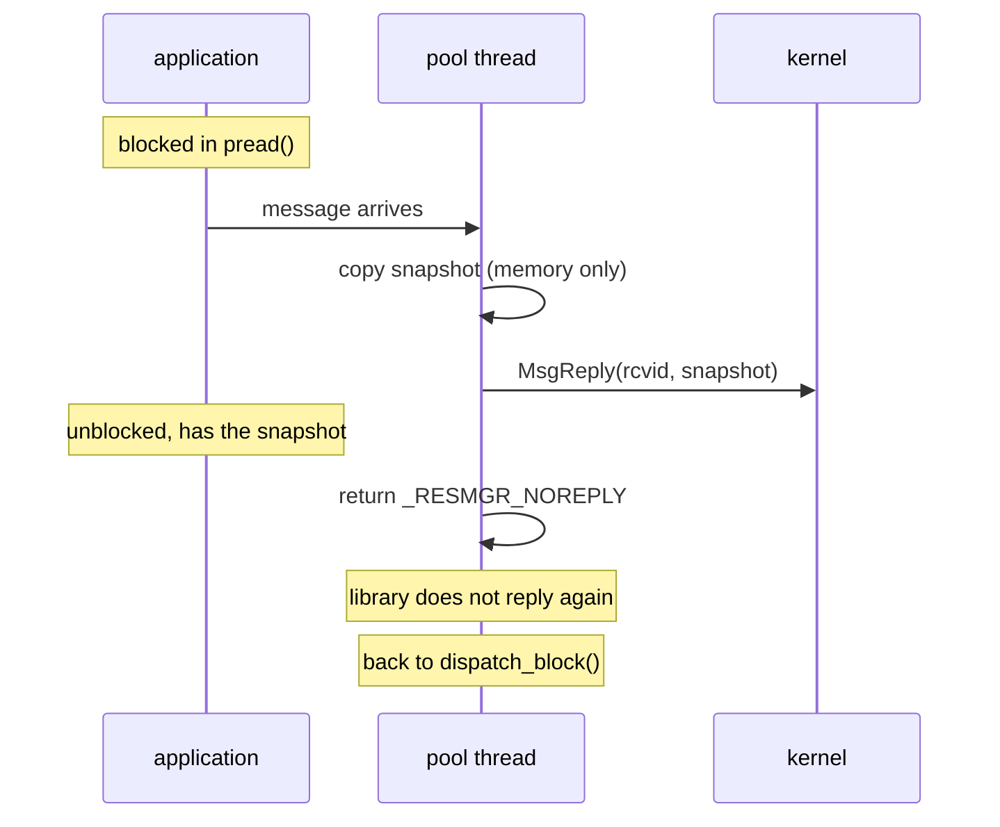

A read costs one message round trip plus a 432-byte copy, with no network and no waiting on the machine. Measured with `cnc_read -b 2000000` in the VM: **2.9 µs minimum, 8 µs average, 84 µs at the 99th percentile**.

## Writes: queue now, reply later

A method call can take milliseconds, or seconds if the machine is struggling. If the pool thread that received the `write()` waited for it, a burst of commands could tie up every pool thread. The QNX guide describes exactly this trap: the receiving thread *"should not block"*, because otherwise it *"could eventually use up a great number of threads"*. And it gives the solution: *"store the receive ID … onto a queue somewhere, and return the special constant `_RESMGR_NOREPLY`"* ([*Getting Started with the QNX OS*](https://www.qnx.com/developers/docs/8.0/com.qnx.doc.neutrino.getting_started/topic/s1_resmgr.html)).

So `io_write` validates the command, pushes `(cmd, rcvid)` onto the ring, wakes the write thread, and returns without replying:

```c
pthread_mutex_lock(&q_lock);
if (atomic_load_explicit(&shutting_down, memory_order_acquire)) {
    pthread_mutex_unlock(&q_lock);
    return ECANCELED;
}
if (q_count == QLEN) {                 /* queue full */
    pthread_mutex_unlock(&q_lock);
    return EBUSY;
}
int tail = (q_head + q_count) % QLEN;
q[tail].rcvid = ctp->rcvid;            /* remember whom to answer */
q[tail].cmd   = cmd;
q_count++;
pthread_mutex_unlock(&q_lock);

sem_post(&q_items);                    /* the write thread takes it from here */
return _RESMGR_NOREPLY;
```

Same return value as in `io_read`, but this time **nobody has replied yet**. The client is still blocked in the kernel, and the reply will come later from the write thread, using the `rcvid` saved in the queue.

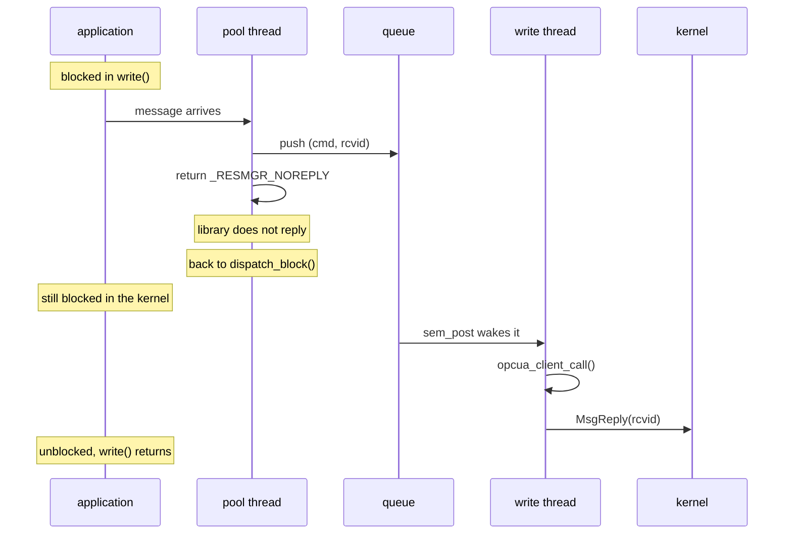

The pool thread is finished with the message before the machine has even seen the command.

The write thread is the only thread that uses the write session: nothing else in the process calls `UA_Client_call()` or touches `write_client`. That exclusivity is what makes the two-session design work, with each session having exactly one thread of control.

## The EINTR case

If a client blocked in `write()` gets a signal or hits its own timeout, the kernel asks the resource manager to release it. The library turns this into a call to `io_unblock`, and *"the unblocking is done by replying to the client"* ([*Writing a Resource Manager*](https://www.qnx.com/developers/docs/8.0/com.qnx.doc.neutrino.resmgr/topic/about.html)):

```c
static int io_unblock(resmgr_context_t *ctp, io_pulse_t *msg, RESMGR_OCB_T *ocb)
{
    int found = 0;

    pthread_mutex_lock(&q_lock);
    if (running.state == CMD_RUNNING && running.rcvid == ctp->rcvid) {
        running.rcvid = 0;                     /* suppress the later reply */
        found = 1;
    } else {
        for (int i = 0; i < q_count; i++) {
            int k = (q_head + i) % QLEN;
            if (q[k].rcvid == ctp->rcvid) {
                q[k].rcvid = 0;                /* the write thread will skip it */
                found = 1;
                break;
            }
        }
    }
    pthread_mutex_unlock(&q_lock);

    if (!found) return iofunc_unblock_default(ctp, msg, ocb);
    if (MsgError(ctp->rcvid, EINTR) == -1)
        CNC_LOG("WARN", "io_unblock: MsgError failed: %s", strerror(errno));
    return _RESMGR_NOREPLY;
}
```

Two cases matter, and they mean different things to the application:

- **still queued:** the entry's `rcvid` is set to 0, the write thread skips it, and **the command never runs**;
- **already running:** the OPC UA call can't be cancelled, so it completes on the machine, but the write thread won't reply, because `running.rcvid` is now 0.

Setting `rcvid = 0` instead of removing the entry is what makes this safe. Once a client has been answered, its `rcvid` can be reused for someone else's message, so a late reply must never go out. The value 0 means "no reply is due", and both the write thread and `io_unblock` check it. This is the bookkeeping the guide asks for: a resource manager that leaves clients blocked must *"keep track of which clients are blocked, so that you can unblock them if necessary"* ([*Writing a Resource Manager*](https://www.qnx.com/developers/docs/8.0/com.qnx.doc.neutrino.resmgr/topic/about.html)).

## The OPC UA side: two sessions, two owners

The driver opens **two separate OPC UA connections**, each with its own `UA_Client` from [open62541](https://www.open62541.org/):

- **read session:** owned by the read thread. It connects, resolves all 33 browse paths to NodeIds with one `TranslateBrowsePathsToNodeIds` request, then loops: one batched Read, publish, sleep `READ_PERIOD`.
- **write session:** used only by the write thread (and guarded by a mutex so the clean shutdown can close it safely). It connects on the first command and resolves the `Methods` object and the three methods.

Each connection has exactly one user, so neither needs to worry about the other. I learned this the hard way: I tried one shared client, with one thread running its event loop and another making method calls, and the calls failed with *"Cannot run EventLoop from the run method itself"*.

**Reconnecting.** If a Read fails, the read thread throws its client away, marks the snapshot `connected = 0` (keeping the last values), and builds a fresh client a second later. If a method call fails because of the connection (`EIO`, `ETIMEDOUT`), the write session is closed and rebuilt on the next command. If the machine merely refuses the method (`EACCES`, `EINVAL`), the session is fine and is kept. A fresh client each time avoids reusing one in a half-broken state.

**Errors.** OPC UA status codes become `errno` values in one place, `to_errno()`: `BadTimeout` becomes `ETIMEDOUT`, `BadUserAccessDenied` and `BadNotExecutable` become `EACCES`, invalid arguments and type mismatches become `EINVAL`, and everything else becomes `EIO`.

**Why polling and not subscriptions.** OPC UA subscriptions are per node: the server sends each value when *it* changes. That doesn't give you "the whole machine at one moment", which is exactly what `cnc_plant_t` promises. One batched Read does. With a plant that ticks once per second, polling twice a second costs little.

## Concurrency in one picture

Three activities overlap:

- the **read thread** reads the machine at a fixed period, whatever the applications do;
- the **pool threads** serve reads from memory and never wait on the network;
- the **write thread** runs commands one at a time, in order, away from the pool threads.

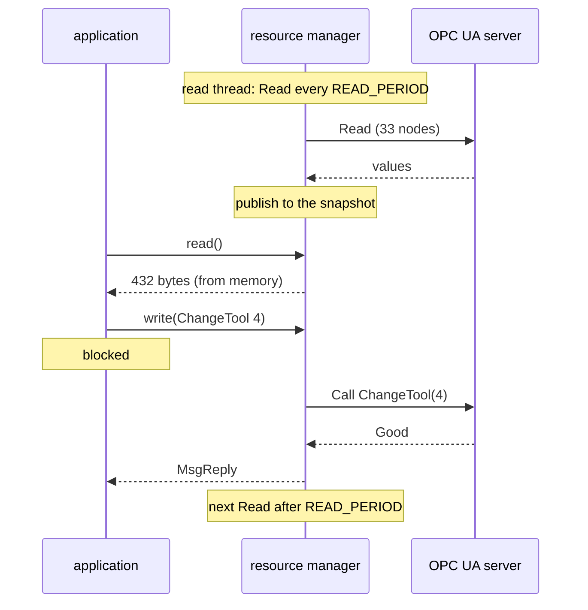

When nothing is happening, every thread is waiting in the kernel: the pool threads in `MsgReceive()`, the write thread in `sem_wait()`, the read thread in `usleep()`. Nothing busy-waits. The only polling is the read thread's deliberate Read every `READ_PERIOD` (the OPC UA section above explains why it polls rather than subscribes).

The locks are only ever held for memory operations: a struct copy on the snapshot mutex, an enqueue or dequeue on the queue lock. **No lock is ever held across a network call**, except `write_lock` inside the OPC UA client. That one is used only by the write thread and by shutdown, never by a pool thread.

### All threads at a glance

| Thread | Job | Priority |
|---|---|---|
| pool threads | receive messages, run `io_read` / `io_write` / `io_unblock` | inherited from the client |
| read thread | Read every `READ_PERIOD`, publish the snapshot | 10 |
| write thread | run queued commands, reply | 12 |
| signal thread | wait for SIGINT/SIGTERM, shut down | default |

## Shutdown

`main()` blocks SIGINT and SIGTERM with `pthread_sigmask()` before creating any thread, so every thread inherits the mask and only the signal thread receives them, through `sigwait()`. It then walks four steps, in order:

1. **Stop accepting commands.** It takes `q_lock` and sets `shutting_down`. A write that was already past its check lands in the queue and gets drained; a later write sees the flag and gets `ECANCELED`.
2. **Finish the running command, drain the rest.** `sem_post()` wakes the write thread if it's idle. It sees the flag, answers everything still queued with `ECANCELED`, and exits; `pthread_join()` waits for it.
3. **Close both OPC UA sessions.** `opcua_client_stop()` stops the read thread and joins it (it closes its own session), then closes the write session under `write_lock`.
4. **Exit.** The process manager removes both paths. A pool thread still replying to a reader is simply ended; reads have no side effects, so a reader can retry.

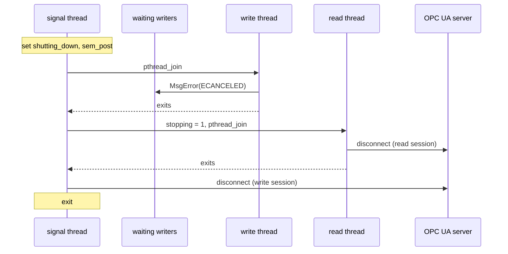

The order matters. If the sessions were closed before the write thread finished, a running Call would fail with a network error instead of the machine's real answer. And if new commands were still accepted while draining, a client could get `EBUSY` when `ECANCELED` is the honest answer.

## Dropping root

Registering paths under `/dev` is the only step that needs root. With `-U uid:gid` the driver drops to that user right after `resmgr_attach()`, before starting any other thread. Note that this also drops the ability to raise the read thread and write thread to SCHED_FIFO, so their `pthread_setschedparam()` calls will fail and log a `WARN` — the code is still correct, they just run at inherited priorities.

## Running it

```sh
./MyDriver -U 100:100 opc.tcp://X.X.X.X:4840/freeopcua/server/ &
```

The log shows the driver coming up, then the read session connecting; the write session appears with the first command:

```
... INFO  serving /dev/cnc/plant and /dev/cnc/methods
... INFO  read session up (opc.tcp://X.X.X.X:4840/freeopcua/server/)
```

`slay MyDriver` stops it cleanly.

## What the POSIX interface buys

The applications see files, and the machine sees OPC UA. Neither side crosses the boundary between them. The calling code stays boring:

```c
cnc_plant_t p;
int fd = open(CNC_PATH_PLANT, O_RDONLY);
pread(fd, &p, sizeof p, 0);
printf("%.0f rpm, tool %d\n", p.spindle.speed_rpm, (int)p.tool.number);
```

There are no request codes and no protocol to parse: one fixed struct, defined in the header. The whole contract is one header containing two paths, the structs and the `errno` meanings.


# 5. Using the Driver

Chapter 4 built the driver. This chapter shows what using it looks like. From the application's side there is nothing QNX-specific: it is `open()`, `read()`, `write()`, `close()`, the same calls you would use on any file. All the application needs is `opcua_cnc_map.h`.

The application opens two paths:

- `/dev/cnc/plant` — `read()` returns one `cnc_plant_t` with every value from the same machine reading.
- `/dev/cnc/methods` — `write()` of one `cnc_cmd_t` runs one method on the machine.

That is the whole interface.

## Reading

The driver, in the background, keeps reading the machine and stores the latest values in memory. When the application calls `read()`, the driver hands over what it already has. It does not talk to the machine.

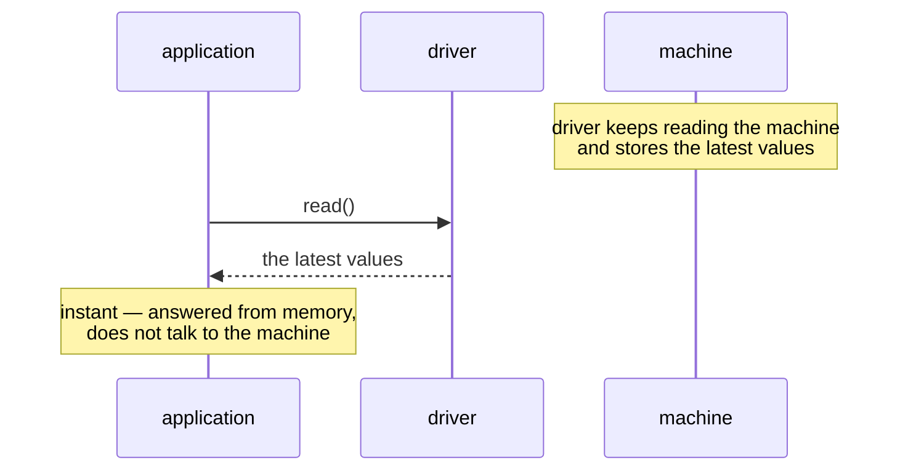

This is why `read()` is fast: it costs a message round trip and a copy, nothing more. The machine may be slow, but the application does not wait for it.

The result is a single `cnc_plant_t` holding everything — spindle, feed, tool, vibration, production, auxiliary systems, machine information — all from the same reading. There is no way for one value to be from a different moment than another.

Keeping the file open and calling `read()` again returns 0 bytes, which is end of file. To poll, the application uses `pread()` at offset 0: it always returns the latest snapshot without moving the file position.


## Writing

A command is different. `write()` sends one method to the machine, and the application waits until the machine answers.

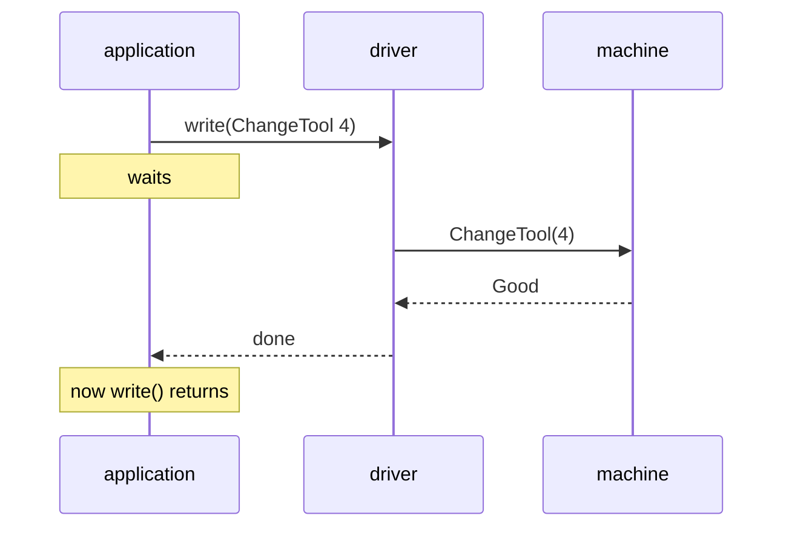

While the application is waiting, the driver's pool thread is not. It has already queued the command and gone back to serving other messages. Only the application is blocked, and only until the machine answers. This is the design from chapter 4: the resource manager never waits on the network; the client does.

If the machine refuses the method, or the link is down, or the command is malformed, `write()` returns `-1` and sets `errno`. The header documents the possible values: `EBUSY`, `EIO`, `ETIMEDOUT`, `EACCES`, `EINVAL`, `EINTR`, `ECANCELED`.

We demanded a tool change to number 4.


The 16.8 ms in the status line is the full round trip from the application's point of view. It covers everything that happens between the `write()` leaving the application and the answer coming back: the pool thread receiving the message and queuing it, the write thread picking it up and sending the OPC UA `Call` to the server, the server executing the method and replying, and finally the kernel unblocking the application's `write()`. The application does not see any of these steps individually; it sees one number.

We pushed emergency stop.


The 13.2 ms here is the same measurement. The two commands took 16.8 ms and 13.2 ms respectively — both dominated by the machine's own response time, not by the driver. The driver's share is small: queueing the command, waking the write thread, and on the way back, calling `MsgReply()` with the `rcvid` that was saved in the queue. Everything in between is the OPC UA server on the other end.

## Conclusion

The driver works because QNX gave us the right primitives, and we did not have to invent anything.

### The send-receive-reply structure

QNX message passing is the reason this design works. A client calls `write()`, the kernel delivers a message, a pool thread receives it — and the handler can reply now or reply later. There is no rule that the reply must happen before the handler returns.

That is what `_RESMGR_NOREPLY` is for. Without it, a `write()` that triggers a slow tool change would tie up a pool thread the whole time. With it, the pool thread is free in microseconds and the waiting happens in the client's kernel thread — the one place where waiting is cheap.

A `devctl()` interface, or a shared-memory ring, would have needed custom code for all of that. QNX already had it. We just used it.

The two-session design is the other half. One thread reads the machine on a cadence, one thread writes when there is a command. Each owns its own `UA_Client`. No lock is ever held across a network call, because no lock is shared between the two paths.

### What the kernel gives you for free

Three things we did not have to write:

- **Priority inheritance** on the snapshot mutex. A high-priority reader blocking a low-priority writer raises the writer automatically.
- **Message-driven priority inheritance.** A pool thread runs at the priority of the client whose message it is handling. No priority logic in our code.
- **Blocking without spinning.** Pool threads in `MsgReceive()`, the write thread in `sem_wait()`, the read thread in `usleep()`. All in kernel wait states.

None of these are unique to QNX. What is unique is that they are the default, not an option.

### Security

The driver trusts anyone who can open `/dev/cnc/methods`. Mode `0220` decides who can write, and that is the whole story. It is not enough for production.

QNX can do better. The OS image itself can declare, before any process runs, that `/dev/cnc/methods` may only be opened by a whitelist of registered applications. The kernel enforces it. The driver does not check anything.

A future version could ship with a policy that names the three or four applications allowed to send commands, register the driver with the process manager to receive only those clients, and refuse everything else before the handler runs. The driver stays simple; the security lives where it belongs.

### Closing

The machine is slow. The applications are fast. QNX gave us a way to keep them apart without inventing a protocol, writing a scheduler, or hand-rolling a queue. The driver is around 800 lines of C, most of it QNX-specific, plus glue. Everything else is POSIX or open62541.

Porting to Linux would be possible, but it would need `io_uring` or `epoll`, a shim for `_RESMGR_NOREPLY`, and its own client-blocking semantics. That is a chapter of its own.

QNX did not make this problem easy. It made it small.


## The repository

Source, build instructions and the full README are at:

**https://github.com/martiniio/my-cnc-qnx-driver**

The driver itself is `MyDriver.c` and `opcua_client.c`. `cnc_read.c` is the interactive tool used throughout this article. The open62541 amalgamation is  committed — but the README also explains how to obtain it.


## References

- QNX SDP 8.0, *Layers in a resource manager*: https://www.qnx.com/developers/docs/8.0/com.qnx.doc.neutrino.resmgr/topic/skeleton_RESMGR_layers.html
- QNX SDP 8.0, *The thread pool layer*: http://get.qnx.com/developers/docs/qnxcar2/topic/com.qnx.doc.neutrino.resmgr/topic/skeleton_threadpool_layer.html
- QNX SDP 8.0, *The resmgr layer*: http://get.qnx.com/developers/docs/qnxcar2/topic/com.qnx.doc.neutrino.resmgr/topic/skeleton_resmgr_layer.html
- QNX SDP 8.0, *The dispatch layer*: http://get.qnx.com/developers/docs/qnxcar2/topic/com.qnx.doc.neutrino.resmgr/topic/skeleton_dispatch_layer.html
- QNX SDP 8.0, *Writing a Resource Manager*: https://www.qnx.com/developers/docs/8.0/com.qnx.doc.neutrino.resmgr/topic/about.html
- QNX SDP 8.0, *Getting Started with the QNX OS*, chapter *Resource Managers*: https://www.qnx.com/developers/docs/8.0/com.qnx.doc.neutrino.getting_started/topic/s1_resmgr.html
- QNX SDP 8.0, *System Architecture*, *Priority inheritance and messages*: https://www.qnx.com/developers/docs/8.0/com.qnx.doc.neutrino.sys_arch/topic/ipc_Priority_inheritance_messages.html
- QNX SDP 8.0, *System Architecture*, *Scheduling priority* (incl. priority inheritance and mutexes): https://www.qnx.com/developers/docs/8.0/com.qnx.doc.neutrino.sys_arch/topic/kernel_Scheduling_priority.html
- POSIX.1-2017, *The Open Group Base Specifications Issue 7* (`read`, `pread`, `write`, pthreads, semaphores, signals): https://pubs.opengroup.org/onlinepubs/9699919799/
- open62541: https://www.open62541.org/